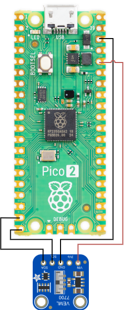
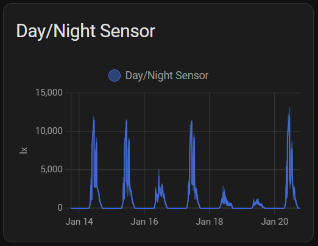

# pi_pico_lux_sensor
## Requirements
1. [Raspberry Pi Pico W](https://a.co/d/g2yz2Yg)
2. [HiLetgo 2pcs VEML7700 Ambient Light Sensor](https://a.co/d/hvVp03M)
## The Hardware
### Diagram


### What to Solder
- VEML7700 SDA to Pi Pico Pin 19 (I2C1 SDA)
- VEML7700 SCL to Pi Pico Pin 20 (I2C1 SCL)
- VEML7700 GND to Pi Pico Pin 38 (GND)
- VEML7700 VIN to Pi Pico Pin 36 (3v3 OUT)

## The OS
Follow the instructions below to install CircuitPython.
[How to Install CircuitPython on a Pi Pico W](https://learn.adafruit.com/pico-w-wifi-with-circuitpython/installing-circuitpython)

## The Code
1. Modify settings.toml with the settings for your environment.
2. Copy the code.py and settings.toml file to the root of the Pi Pico.
>[!Note]
>I use Thonny to manage files on the Pi Pico. [Here is a great tutorial.](https://www.thinkcreatelearn.co.uk/resources/raspberrypi-pico-recipes/thonny-circuitpython/index.html)
3. Copy the contents of lib to the lib directory on the Pi Pico.
4. Reset the Pi Pico and the code should now be running. If you are connected via serial, you should see updates on the console.

## Integrating with Home Assistant.
I use the Mosquitto Broker addon as my MQTT Broker. Below is the sensor code from my configuration.yaml file.
[MQTT](https://www.home-assistant.io/integrations/mqtt/)

```
mqtt:
  sensor:
    - name: "Day/Night Sensor"
      state_topic: "home/kitchen/sensor1"
      unique_id: "day_night_sensor_1"
      device_class: "illuminance"
      state_class: "measurement"
      unit_of_measurement: "lx"
```
Here is what it looks like as a dashboard card.
